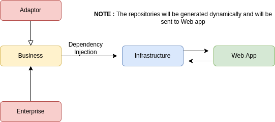

## Django - DDD and Clean Architecture

### Introduction to folder structure

#### Adapters :

    Adapter is for any third party service like db message broker , apis ,generators etc.

#### Enterprise :

    It is used to write client specific modules ,exceptions ,validators  etc. 

#### task/infrastructure :

    This part of project is for framework or web service you want to user to deploy your business app and also in shared folder you need to confugure dependencies injector for using our modules in web service

#### task/business :

    This folder is for modules of business logic that includes modules exceptions DTOs services etc.

#### test :

    This folder will be use to run testcases for adapaters, enterprise and to test every module combined,

### Project Setup

#### 1. Clone  the repo

    git clone https://github.com/rajatmishraintntra/djangpocimpro.git

#### 2. Install project as site-package

    cd djangpocimpro and run pip install -e .

#### 3. Install dependencies

    pip install -r requirements.txt

#### Set the Environment variables

| Variable name | Optional | Default Value |
|---------------|----------|---------------|
| db_name       | No       |               |
| db_host       | No       |               |
| db_user       | No       |               |
| db_password   | No       |               |
| db_driver     | No       | postgresql    |

#### 5. Run migrations and start the server

    python ./infrastructure/djangopoc/manage.py makemigrations && python ./infrastructure/djangopoc/manage.py migrate && python ./infrastructure/djangopoc/manage.py runserver

### Flow-Diagram

